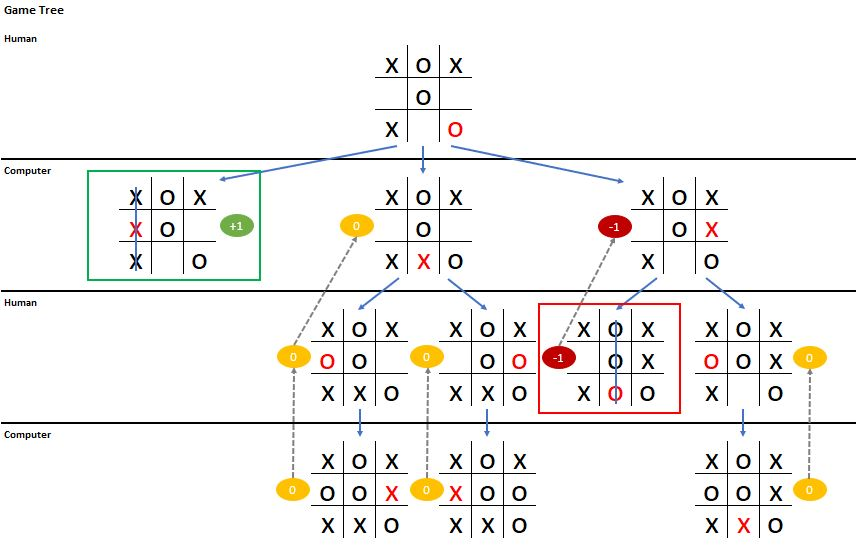

# Unbeatable Naughts & Crosses

Minimax is an AI algorithm used to decide the next best move in two player games like chess and go (zero-sum games). 
Basically, it goes through all the possible moves between two players, and scores each simulated game result according to the end status. 
If the AI player wins, it is given a positive score. If the opponent player wins, it is given a negative score. If it is a draw, it is given score 0. 
Then we roll up the scores to their upper level nodes. 
If the lower level is played by AI, then it passes up the maximum score. If the lower level is played by the opponent, then it passes up the minimum score. 
The principle is each player is most likely to go for the step which leads themselves to win. 
When it rolls up the scores to the current level, we can then choose the most optimal next move according to the scores!

Illustration with a half way Noughts & Crosses game:

